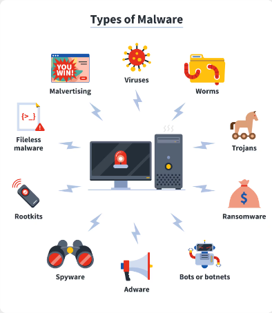
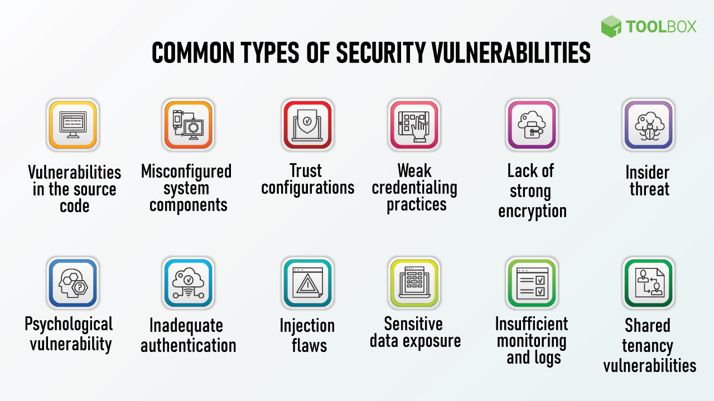
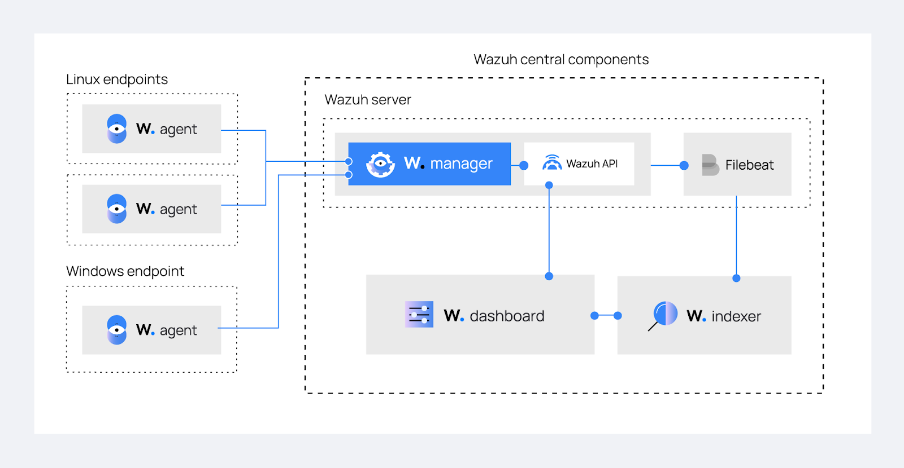

    

# Blue Team: Incident Handler

## İçerik

1. Siber güvenlik ekiplerini ve görevlerini, kuruluş amaçlarını ve ayrımlarını ele alacağız.
2. Blue Team ekibi ve görevlerini, kuruluş amaçlarını ve ayrımlarını ele alacağız.
    * Incident Response, Threat Hunting, Malware Analysis, Threat Intelligence, SOC, Digital Forensic, Network Defense, Software Security ekiplerinin görevlerini, kuruluş prensiplerini ve işleyişlerini ele alacağız.
3. Threat Hunter ekiplerini ve Threat Hunting prensiplerini; Threat Hunting prosedürlerini ve işleyişini ele alarak olası anomalilerde hunting taktikleri ile keşfi ele alacağız.
4. Incident Response ekibini ve IR prensiplerini ele alacağız.
5. Cyber Kill Chain adımlarını ve bu adımları engelleme/tespit etme taktiklerini inceleyeceğiz.
6. Kurumsal Savunma hattı oluşturmayı ve savunma prensiplerini;
    * Defense in Depth'i full spektrum ile ele alarak incelemeyi sağlayacağız.
7. Hunting Lab ortamı dizaynını ve geliştirilmesini;
    * Open Source Host based IDS ve Network based IDS dizaynı, alarm aştırılmasını sağlayacağız
    * SIEM dizayn ve alarm geliştirilmesini sağlayacağız.
    * Saldırı Simülasyonlarıyla testler yapacağız ve analizler tespit edip alarm açtıracağız.
    * Lab ortamının geliştirilmesini sağlayacağız
8. Ve birçok blue team teorik ve pratik konularını ele alacağız.

## Bölüm 1: Understanding the Blue Team Methodology

### ÖZET

Bu eğitimin genelindeki Siber güvenlik sektöründe, özellikle Blue Team alanında sahip olmanız gereken enterprise defense yaklaşımları, prensipleri ve metodolojileri üzerinde duracağız. Blue team alanında ilerlemenin ve başarılı olmanın en önemli anahtarı, bu noktalarda uzmanlaşmak ve bütünü görerek hareket etmek önemlidir.

Kariyeriniz boyunca kullandığınız araçlar ve markalar ne kadar değişse de öğrendiğiniz prensipler ve metodolojiler sayesinde onlara adapte olma ve yeni teknolojileri kavrama açısından o kadar hızlı olacaktır. Burada göreceğiniz öğretiler, çünkü markalar ve araçlar her bir kurumda sürekli değişebilir. Veya farklı bir kuruma geçtiğinizde değişebilir. Bunlara bağlı kalmamanız gerekmektedir. Ve bunun arkasındaki teknolojileri ve enterprise security'de yarattıkları etkileri öğrenmek.

Yeni bir şey öğrenmek, bir puzzle çözmek gibi olur. Çok hızlı adapte olursunuz. Bir daha baktığınızda çok çabuk çözebilirsiniz. Arkasındaki teknolojileri, prensiplerini ve nedenlerini öğrenmek sizi her zaman bir adım öne çıkaracaktır. Karşınıza gelecek sonraki puzzle'da her şeyi nasıl yerli yerine yerleştireceğinizi çok rahat öğreneceksiniz.

### Introduction: Incident Handler

**Incident Handler: Olayın yönetimi ve olayı ele alış, olaya ilk başta kontrol sahibi olup sürdürme ve bu olayı sonuçlandırmaya doğru götürme.**

Bir SOC ekibinde çalışan Tier 3 olarak çalışan threat hunting pozisyonunda çalışan birinin teorik ve yarı pratik bilgilerini edinmiş olacağız. (Yarı pratik: Tamamı siz bir şeyleri aramadıkça kurcalamadıkça tam bir pratiklik elde edemeyeceksiniz).

En iyi eğitmen, insanın kendisi ne kadar araştırır ne kadar kurgular ne kadar pratik bilgiler edinirse o kadar çok kendisi öğrenir.

> Mavi hapı alırsan hikaye biter. Yatağında uyanır ve istediğin şeye inanırsın. Kırmızı hapı alırsan Mucize Ülkesinde kalırsın ve sana tavşan deliğinin ne kadar derin olduğunu gösteririm. Unutma! Sana gerçeği öneriyorum. O kadar. (Morpheus)

### Chapter 1: Cyber Security Teams

Siber güvenlik perspektifinden bakarak blue team metodolojilerini anlamamız gerekiyor. Öğrenme sürecimizde bu metodolojilere odaklanacağız ve onları anlamaya çalışacağız.

### Cyber Security Teams

Siber güvenlikteki alt ekipler.

Bütün teknolojik konuda olduğu gibi siber güvenlikte de kendi içerisinde alt ekiplere ayrılmıştır.

* Bu grupların ne olduğu bilmenin başlıca nedenleri arasında ekip içi görev ayrılığı ilkesi **SOD (separation of duties)**.
  * Uzmanlıklara göre gruplara ayrılmak büyük bir kurum ve kuruluşlarda bilgi güvenliği altyapısının operasyonunu yönetimini kolaylaştırıyor.
  * Bir yetenekle uzmanlaşmış bir insanı işe alımını ve ondan faydalanmayı da daha kolay hale getiriyor.

Renklere göre bir dağılım ve ayrım var.

1. **Yellow Team:** Yazılım çözümlerinin yaratıcılarında oluşan bir ekip (Software coders and Architects "The Builders" olarak geçiyor). Bu ekip aslında yazılım geliştirmek test etmek ve dağıtımdan sorumlular.

    * Bu ekibin genel amacı, temel olarak aslında siber güvenlik ekibi ile ortak çalışan developerlar ve siber güvenlik ekibinin dokunduğu noktalardaki developerları da bu işin içerisinde dahil edebilirsiniz. Bunlar genelde siber güvenlik ekibi için yazılım geliştiren ekiplerden de oluşabilir. Veya diğer yazılım ekiplerine ve siber güvenlik ekibine katkı sağlayan ekiplerde olabilir.

2. **Green Team:** Birincil ekiplerin nasıl etkileşime girdiğini rehberlik eden politika ve frameworkleri formüle eden ekiptir. **"Enhance secuirty and automation with design and code"** kısmına da kendileri el atıyorlar.

3. **Orange Team:** (Facilitate interaction and education) Kolaylaştırma ve eğitimler ile ilgileniyor. Bunlar kurum içerisindeki eğitimler olabilir. Kurum için interaction'lar olabilir. "Security Evanescence" konuları ile de ilgilenebilirler.

    * Not: Türkiye genelinde Information Security ekipleri var. Bu ekipler aslında hem orange team'in el attığı konuları hem de bu kısımda white team'nin el attığı konularına dahil oluyorlar. Bir noktada green team'e de dokunuyorlar. Security'nin politika ve prosedürlerine dokunulması kısmında.

4. **White Team:** (Analysts Compliance Logistics Management) Aslında tüm renklerin birleşimi olan ortada yer alan kısım. Bu ekip aslında yönetimi idaredeki insanlardan oluşuyorlar. Daha çok management ve compliance konularına el atıyorlar.

5. **Red Team:** (Offensive security) En iyi savunma saldırıdır. Red team aslında offensive security ekibinden oluşan bir ekip.

    * Red Team'in "Red Teaming" Red Team olarak vurgulandığı bir kısım var.

    * Red Team, offensive securtiy olarak vurgulanması daha mantıklı ve kendi içerisinde birçok kola ayrılıyor. Ve birçok kolda değerlendiriliyor.

        * Kurumdaki böyle yapıların ve sistemlerin, siber güvenlik perspektifinde testlerinin ve hatta "kontrol denetimlerini" yapan ekip Red Team

        * Bu kontrol denetimleri neyden oluşabilir örneğin, bir business logic ortamındaki transactionların veya tamamen bir depodaki yürütülen işlerin bu ekip tarafından bir kontrol edilip sosyal mühendislik açısından da denetlenmesi gerekir. Bu nedenle aslında "kontrol denetimleri yapan bir ekip" olarak da rol alabilir.

        * Red teaming testlerini gerçekleştirirken elde edilen sonuçların böyle iyileştirilmesi için ekiplere eskalasyonu da sağlarlar (Diğer ekiplerle de çok etkileşimde bulunan bir ekip).

        * Çoğu konuda red team'in personeli siber güvenlik ekibinde bulunan bazı kurumlarda danışmanlıklar aracılığıyla faydalanabiliyorlar.

            * Red Teaming tarzındaki faliyetlerini aslında pentesting faaliyetlerini danışmanlıklardan alıyorlar.

    * Red team denildiğinde, red teaming veya pentesting faaliyetleri içine sıkıştırılırsa bu ekip o zaman işte tamamen hatalı bir sonuca gidiyoruz.

    * Red teaming aslında çoğu konuda olduğu gibi siber güvenlik ekibinde bulunuyor. Bazı kurumlarda danışmanlıklardan faydalanıyorlar nedeni pentesting ve red teaming olarak görmeleri.

        * Red Team sadece application securtiy, red teaming veya vulnerability management'tan oluşmuyor. Aslında bunların hepsinin birleşiminden oluşan bir ekip.

        * Bir testin yapılma amacı ana kuruluşların red teamlerin artta gelen pentesing ve red teaming faaliyetlerinin yapılma amacı aslında kurum envanter ve süreçlerini iyileştirmek.

        * Bir pentest'in sonuçları ne çıkar.

            1. Kurumunuzun sahip olduğu yanlış dizayn edilmiş kontrol mekanizmaları.
            2. Zafiyetli olan sistemler ortaya çıkar.
            3. Zafiyetli olan süreçler ortaya çıkar.
            4. Zafiyetli olan yazılımlar ortaya çıkar.

            * Bunların her birinin takip edilip, iyileştirilmesi gerekiyor.

        * Raporların kurum içinde iyileştirilmesi 6 ay'dan 1 yıla kadar sürebiliyor. Bir değişiklik yapmanız örneğin: sunucularda bulunan bir zafiyetin iyileştirilmesi için pacing yapılması gerektiğinde biri bu pacing hemen yapılamıyor. Neden çünkü business'taki etkisine bakılıyor. Business flow'daki neyi sekteye uğratacak mı ona bakılıyor. Business continuity planning'e bakılıyor(Business tamamen devam ettirilmesi, sürdürülmesi aşamasında nereye etki edebilir. Hangi noktada neyi duraksatabilir) bunlara bakılıyor. Development ekiplerinin Security ACNC konularında eğitimler verilmesi.

6. **Blue Team:** (Defensive security "The Defenders")

    * Kurumunuzdaki yapıların, sistemlerin, süreçlerin önem derecelerini öncellikle ardından erişe bilirlik durumlarına, dışarıya açık mı içeriye açık mı, nasıl erişiliyor, bir IPsec ile mi giriliyor gibi konular bunların hepsini ile ilgilenir ve kritiklik düzeyi, bu hedeflenen bir yapının veya sistemin bir iş sürekliliğini sağlaması konusunda bir noktaya gelirse ne kadar bu sistem offline kalabilir. Ve ne kadar bu süreç durabilir gibisinden durumların hepsini analiz edilerek siber savunma hatlarını oluşturulmasını sağlayan. Bu hatları ve ilgili yapıları, sistemleri ve sürekli monitör ederek kurum savunması sürdüren ekip. Bu nedenle bu ekip bir kurumun sahip olduğu envanteri takip edecek ve olası bir incident durumunda olaya el atacak. Ve gözetleyecek bir SOC ekibinden oluşması gerekiyor.

    * Threat Intelligent Uzmanları: Kurum içi ve dışında elde edilen bilgileri işleyip bu bilgileri belli metriklerle size bulgu verecek veya hatırlatacak bir şekilde bir yapıya ulaşabilirseniz. Ve bu dışarıdan gelecek istihbaratları değerlendirebilecek bir ortam sağladınız anda bunlarla ilgilenen kişilere denir (Bir kurumun maruz kaldığı ve kalacağı veya kalabileceği durumları analiz etmek ve bu durumlara yönelik kurumun bilgilendirilmesini sağlamak, kurumda bir bilgi havuzu oluşturmayı sağlayan uzmanlardan oluşuyor).

    * Threat Hunting: Kurum için envanterlerden planlı olarak belirli özel bir noktayı hedefleyerek

        * örneğin ben bugün ağ topolojisindeki Intrusion Prevention System (IPS)'in heat durumlarına bakacağım. Diyen veya bunları gözlemleyen, işleyen ekip olarak threat hunting uzmanlarından oluşan bir ekip olabiliyor.

        * Bu kişiler aslında anomali keşfine çıkabiliyor kurum içerisinde.

        * SOC ekibinde çalışan insanlar "threat hunting'e" fazla vakit ayıramıyorlar. Çünkü olası zaten belirlenmiş tetiklenen alarmları inceliyorlar. Bu alarmlar haricinde hunt'a çıktıklarında tekrardan bir alarm geleceği için yarım kalabiliyor veya bu şüphelendikleri durum üzerinden yoğunlaşıp inceleyemiyorlar veya sadece bir durum veya özne içerisinde inceleyebiliyorlar.

        * Kurum içerisinde beli bir plan ve prosedüre bağlı olarak belli noktaları devamlı araştırıp eden bu kısımlardaki anonimleri aslında derinlemesine inceleyen uzananlardan oluşuyor.

    * Malware Analysts: Olası bir zararlı yazılım keşfi sonrası incelemeler sağlayıp saldırganların belki de bir kurum hakkındaki hedeflediği bir zero day keşfederek ortaya çıkmasını sağlayan bir malware analiz uzmanlarından oluşuyorlar.

        * Bir zararlı bulaşıp mevcut kullandığı EDR, EPP, anti virüs, XDR ve IPS ürünün keşfedememesi sonrası bu zararlı yazılımı bulduktan sonra IoC'lerini bu araçlara ekleyerek silinmesini sağlar. Ama bu ilgili zararlının analizini tamamıyla bu IoC'sine eklediği kullandığı zararlı yazılımların tamamen ekiplerine bırakır. Ama gelişmiş bir siber güvenlik hattı oluşturan bir kurumda bu tarz bilindik IoC'lerin olmadığı ve doğrudan sizin kurumunuzu hedeflediği gözüken spesifik bir saldırıyı siz analiz etmek zorundasınız.

            * Örnek sizin mail security gapinizi bulup oradan nasıl ilerleyeceğini keşfeden bir saldırgan olabilir.

            * Veya ürettim hattında çalışan bir firma olduğunuzu düşünün sizin içerde çalıştırdığınız bir skada sisteminiz var. Dışarıya tamamen kapalı içeriden bir şekilde bilgi sızıyor. Envanteri hedefleyecek bir zararlı yazılım olabilir bunları zararlı yazılım uzmanları tarafından analiz edilerek ortaya çıkarılabilir.

            * Veya sizi bir apt (Gelişmiş saldırganları nitelendiren bir kısaltmadır) faktöründen koruyacaktır.

    * DFIR Digital Forensic Team (Adli Analiz Uzmanları): Tamamen olası bir durumda incident olduğu bir incident sonucunda belirli makineler veya sistemler compromise oldu bu makinelerin ve envanterlerin adli analizini sağlayacak legal ekiplerle ve bağlı bulunduğunuz regülasyonlar dolayısıyla sorumlu olduğunuz firmalara belirli kanıtları sunabilecek bu envanteri üzerinde adli analizler yapıp raporlandırma sağlayacak. Bu bahsedilen yükümlü olduğumuz bildirim yapmamız gereken kuruluşlara bildirim yaparken vereceğimiz raporları hazırlayacak kişilerden oluşan Adli analiz uzmanlarından oluşuyor.

7. **Purple Team:** Hem read team'in hem de blue team'in bir araya gelmesiyle oluşan. Bu iki ekibi koordineli olarak çalışmasını sağlayan bir ekipten oluşuyor.

    * Hem saldırı hem de savunma hatlarında uzman olmuş insanlardan oluşsa da purple team'in amacı bir kurumdaki hem savunma hatlarının hem de yapılan sistemlerdeki tatbikatların ölçümlenip savunma hatlarının sistemdeki tatbikatlarla ya da yapılan red teaming faaliyetleri ile ne kadar etkileşimde olduğu ve iyileştirilmeye gidildiğini bizi bilgilendiriyor.

### BLUE TEAM'in ALT EKİPLERİN DEĞERLENDİRİLMESİ

İlk olaya el atanlar SOC ekiplerinden uzmanlar oluyor.

* Örnek bir alarm tetiklendi bu alarm yurt dışından bir IP'nin kurumumuzun dış envanterine bağlı olan bir makinemiz var DMZ'de bulunan bu makinenin RDP portu açık olarak unutulmuş. Yurt dışından bir ip bu RDP portuna bağlantı sağlıyor. Bu durumda SOC ekibi ilk olarak bunu karşılıyor.

Ne Yapıyor:

* Yurt dışından, IPSec tünelleri ve farklı etkileşimde olan IP'leri hedeflenmeden farklı IP'lerden gelen bir RDP bağlantısı sonrasında direk alarm üreten bir yapımız olduğunu varsayın (IDS, SIEM veya Gelişmiş Log Yönetim Sisteminde), SOC ekibi el atıyor. SOC ekibi incident handler olarak olaya ilk el atıyor. Bir incident ilk karşılayan ekip oluyor.

* İlk olarak bir kontrol mekanizmasından geçiyor.

* Alarm doğru tetiklendi mi false pozitif mi? (Bir bağlantı olmuş, firewall logunu kontrol ediyor ilgili bağlantı allow almış (false) değil veya teardown değil ya da yarıda kesilmiş bir bağlantıda değil (allow almış)) Tamamen bu bağlantı kurulmuş ve ilgili IP bu bağlantıya geçiyor olarak gözüküyor.

* SOC Ekibi aslında burada 2'ye ayrılan binr ekip olabilir.

1. Incident Response Team: Incident Response ele alan bir Tierless yapıdan oluşan bir SOC ekibi olabilir veya genel anlamda şu anda biraz daha old school olan tiered mekanizmadan oluşan bir ekip olabilir. Bu tier mekanizmadaki ilk ekip SOC analistteki arkadaşlar bu olayı direk eskale ediyorlar eskale ettikten sonra da ilgili tier 2'deki arkadaşlara geliyor. Tier 2'deki arkadaşlar aslında incident response ekibinden oluşan kişilerden oluyor. Bu incident response'daki arkadaşlar

    * ilk olarak olayı bir analiz etmek durumunda identify etmek zorunda

    * Olay'a bakıyorlar cidden doğru bir olay dışarıdan bir IP erişmiş bu IP'nin erişimleri devam ediyor. Bu noktada direk response vermeleri gerekiyor.

    * Response vermeden önce kendi ekiplerindeki sistem ekibindeki arkadaşlarla görünmeliler. İlgili makinedeki port neden açıktı ve bu portun kapatılması gerekiyor mu business etkilenecek mi kapatıldığında bunları kontrol etmek gerek. Business etkilemiyor yanlışlıkla açık unutulmuş bir durum hemen sistem ekipleri göz attıktan sonra ilgili olaydaki makinedeki RDP kapatılıyor. Kapatıldıktan sonra ilgili RDP yapıldıktan sonra o makineye yapıldığı için o makinenin bir containment'ta alınması gerekiyor. Yani bu makinenin izole bir ortama tanışıp incelenmesi gerekiyor.

    * İlgili makinenin izole bir ortama alındığı anda business etkileyecek mi bunu bir soruşturmak gerekiyor. Etkilemediğini göz atarsak artık o makina incelenmesi gerekiyor. Bu makine üzerine baktığımız anda ne yapılmış bu makine üzerinde bir dosya çalıştırılmış bu dosya çalıştırıldıktan sonra birçok makineye doğru bir port taraması gerçekleştirmiş artık incident response ekibi yapılan taramalar doğrultusundaki elindeki alarmları topluyor. O makine ile ilgili ve o makinedeki, containment'a aldığından dolayı o makinede yapılan çalışılan containment’daki bir dosyadaki örnekleri de alınması gerekecek. Artık bu noktada incident response ekibi alanında uzman kişilere gitmesi gerek.

    Özet Aşamalar:

    * Indentify
    * Response
    * Improvement

    Sahip Olunması Gerek Özellikler:

    * Bir EDR üzerindeki veya kurumdaki bir security araçları üzerindeki detection sağlayan security araçları üzerindeki log okumaları veya ilgili bildirimleri alarmları okumalarını çok iyi bir şekilde sağlamaları gerekiyor. Bu bir EDR olabilir NDR olabilir bu gibi araçlardan gelecek veya kendimizin dizayn ettiği SIEM üzerinde dizayn ettiğimiz alarmalar bunların her birini analiz edip iyice bir göz atmaları ve doğrulamaları gerekiyor. SOC ekibinde bu ekip içerisinde var olabilir.

    * Bu ekip bir incident geliştiği anda o incident'ı tanımlamak o incident'ı ilk durumda ele alıp doğru şekilde eskale etmek zorunda.

2. Malware Analysis Team: Zararlı yazılımlar konusunda uzman bir ekipteki arkadaşlardan oluşuyor. Bu analizdeki arkadaşlarımızın öncellikle containment'a aldığımız makinede:

    * EDR yüklü mü diye kontrol ediyoruz. Genelde kurumların çoğunda bir EDR veya uzaktan bir tekrardan terminale bağlanacak ilgili makinede containment'a alacak bir yazılım bulunuyor.

    * İlgili zararlı yazılımın kopyalarını alıyorlar. Bunu kontrollü bir biçimde yapıyorlar. Containment'ı aşmayacak şekilde bunu sağlıyorlar.

    Özet Aşamalar:

    * Identification
    * Detect
    * Analysis

    Tamamen ilgili gelen zararlının IoC'lerini incelenmesi, reverse engineering yapılırken ilgili bulunan noktaların değerlendirilmesi hangi process'lerin çalıştırıldığın bulunması, hangi process'lerin fail process ürettiğinin keşfedilmesi veya hangi register key'leri hedef alarak bu işlemlerin gerçekleştirildiğinin bulunması veya bir malware'ın FIN aşamasındaki hangi noktaları tamamen es geçiyor veya değişikliğe neden oluyor. Bu noktaların bulunması hem ilerideki olaylarda alarmlarımızda güçlendirebiliyor.

3. Digital Forensics Team: Bu ilk aşamada bir makineyi tamamen dokunmadan önce de bu makinenin adli olarak bir snapshot'larının alınması, disk imajlarının, ram imajlarının alınması tamamen gerekiyor. Bunlarında alınması da ilk aşamada digital forensics ekibi sağlaması gerekiyor.

    Olaya geri dönecek olursak:

    * İlk aşamada incident response ekibi olayı buldu bildirdi ve makineyi izole etti containment'a aldı ağda acil olarak hızlı bir şekilde response olarak RDP'yi aslında kapattı bu noktada değerlendirecek olursak ilk aşamada RDP'yi kapattırması gerekiyor muydu veya gerekmiyor muydu?

    * Eğer makindeki RDP'yi kapattırmasaydı, belki saldırganının dışında farklı bir makineye de sıçrayacaktı veya daha sonrasında işte o makinenin sıçradıktan sonra artık sıradaki bir makineye geçmiş olacaktı containment'tan sıyırmış olacaktı aslında o nedenle makinedeki RDP'yi kapattırmak business continuity engellemezse bir sıkıntı yok gibi (Bu makineler genelde sanal ortamlarda çalıştıklarından ilgili portların kapatılması ve işlenmesinde izole alınması da hızlıca gerçekleştiriliyor).

    * Tamamen containment alınmış bir makinede izolasyona alınmış bir makinede

    * Digital Forensics ekibindeki arkadaşlarımızı çağırıp ilgili makinenin sistem ekipleri tarafından bir snapshot’larının alınması, ram imajlarının alınması bunları tamamladıktan sonra malware analizdeki arkadaşlarımızın o dosyayı alıp incelemesi gerekiyor. O dosya üzerinde bir tersine mühendislik yapıp veya sandbox'ta (Bir dosyanın tamamen izole ve takip altında olunan bir sistem altında açılıp incelenmesi ve zararlının yapacağı aksiyonlara göz atma) tanımlanan sanal bir ortamda çalıştırıp analiz yapılabilir. Sandbox'ta da incelenebilir. Bir noktada temel IoC'lerinden faydalanarak zararlı yazılım incelenebilir. Hash'ini alarak ve birçok portalda taratarak gibi işlemlerden geçebilir.

    Özet Aşamalar:

    * Preservation
    * Contain
    * Investigation

    * Elimizde bulunan cihazların adli analiz bakımından incelenmesi için delilerin karartılmadan her hangi bir dedil değişikliğine uğramadan nasıl imajların toplandığı, nasıl ilgili dosyalar alındı, makine nasıl Containment alındı, ilgili süreçler nasıl rapolarlandı bu aşamaların aslında bir şekilde oluşturulması gerekiyor.

4. Network Defence Team: İlgili incident'ımızda belki de RDP'yi kesecek olan ekip belki de ilgili makineyi containment'a alacak ekip aslında network defence ekibinde olabilir.

    Sahip Olunması Gerek Özellikler:

    * Network defence ekibi içince NOC ekibi de bulunabilir. SOC'den ayrı olarak bu ekibin en büyük avantajı, anomali yapmış bir RDP bağlantısı ya da dışarıdaki bir IP'nin external veya internal bir bağlantı oluşturması ve bu DMZ ortamında anormal bir şekilde anormal bir porta giderken oluşturması RDP portuna bu bir şüpe çekebilir bu ekip tarafından yakalanabilir. Bu ekip bu yakaladığı bulgular sonrasında tamamen yok etme aşamasına kadar eradicate sürdürebilir. Ortamını bunları yaparken incident response ekibi ile çalışması gerekiyor.

    Özet Aşamalar:

    * Secure Mitigate
    * Monitor
    * Eradicate

5. Software Security Team: Kendi içerisinde bir güvenlik yazılımı geliştiren bir ekip olabilir. Blue team içerisinde ya da blue team'in kendi yazılımlarını geliştirdiği incident response'da bulunan veya malware analiz team'de bulunan bir arkadaşta olabilir. Bu ekip aslında blue team'in ihtiyaç duyduğu araçları, platformların, tamamen geliştirilmesi ve geliştirilen bu cihazların tamamen kurum içerisinde politika ve prosedürlere yönelik artık uygulanmasını sağlayan bir ekip olabilir. Bunların ilk testlerini yapıp product aşamasına alıp ekipler ile kurgulamaya sürükleyen ardından bir politika ve prosedür dizayn edip hangi durumlarda hangi noktalarda hangi prosedürler izlenerek bu aracın kullanılmasını sağlayacak ekip olabilir. Bu ekip devamlı bir development geliştirerek ilgili süreçlerimizin düzenlememesini ve ihtiyaç duyulan yazılımların kurum içerisinde geliştirilmesini sağlayabilir.

    Özet Aşamalar:

    * Recover
    * Developement
    * Control

6. Cyber Threat Intelligence Team:

    * Malware Analizdeki arkadaşlar, belirli IoC bulmuşlardı

    * Network Team'deki arkadaşlar, bu makineni IP'sini tespit etmişlerdi.

    * Incident Response'daki arkadaşlar, ilgili IP bulup engellemişti.

    * Topladığımız bütün bu IoC'lerin Threat Intelligence'daki arkadaşlarımıza bilgilendiriyoruz aslında biz böyle kaynaklar bulduk bize doğru bir incident geliştirdiler. Bu topladığımız verileri Intelligence’daki arkadaşlarımıza verdiğimizde onların radarına neden takılmadığını bulmaya çalışıyoruz.

    * Mesela bir threat intelligence listelerinden beslenen bir firewall olduğunu düşünün firewall engel kuralımızın acaba neden bu IP'ler bulunmadı veya bu spesifik olarak ayağa kaldırılmış bir makine mi bizi hedefledi gibisinden düşünebilirsiniz. Threat intelligence ekibimizi ilgili konularda bilgilendirip onlardan bir tehdit istihbaratı konusunda araştırma yapmalarını ve belki danışman firmalar aracılığı ile onlara danışarak bulgu toplamalarını rica ediyoruz. Bu konuda kendileri el atabiliyorlar.

    Özet Aşamalar:

    * Managing

    * Supporting

    * Research

    * Bütün ekipler aslında bir araya gelerek "software security team'de" gelebilir. Blue Team içerisinde olan. Burada neyi kaçırdığımızı nasıl iyileştirebileceğimizi neler yapabileceğimizi değerlendireceğimiz. Bir aslında bir ekip "tabletop" oluşturulabilir.

    * Bu tabletop'larda aslında ekibin bir araya gelerek neleri geliştirebileceğimizi, neleri iyileştirebileceğimizi düşünebilecekleri bir ortam olabilir. Bu ortamda değerlendirerek her ekibe söz hakkı vererek kendi görüşlerini ortaya koymasını neden böyle bir incident yaşandığının değerlendirilmesi yapılabilir. Ve mesela bu ekibin toplanmasından önce de mutlaka bir "lesson learning" toplantısı oluyor genelde "lesson learning" toplantılar aslında bir incident'ın gelişmesinden sonra yapılan toplantılar. Neler öğrendik bu konudan bu toplantı sonucunda edindiğimiz bilgileri tabletop'ta inceleyebiliriz daha sonrasında.

    * MISP: Threat Intelligence verilerini toplayan ve bunları işleyen bir platform

### SOC Simplified SOC Tiers

SOC normalde global'de çeşitli kuruluşlarda tier mekanizması ile çalışan bir yapıya sahip bunun belirli artıları olduğu gibi eksileri de var.

SOC (Security Operations Center), Türkiye’deki diğer çevirisi SOME olarak geçiyor. Siber olaylara müdahale ekibi

SOC temel görevleri vardır. Bunların başında aslında tamamıyla şey geçiyor. Bir olaydaki kurumdaki incidentlara ilk müdahalede bulunmak incidentların oluşmasını engellemek, tespit etmek ve oluşan bu incident'ların tamamen kontrol altında bir şeklide eskale etmek ya da çözümlemek.

Göz attığımızda 3 basamaktan oluştuğunu görüyoruz. SOC'nin aslında 4 basamaktan oluşuyor. Son basamak tier 4 olarak dediğimiz SOC Team Lead veya SOC Manager olarak kabul edebiliriz.

Tier'lı olarak incelediğimizde SOC'de genelde, globalde ve Türkiye'de birçok kurumda tier mekanizması var.

1. Tier 1 amacı yani SOC analistlerinin amacı

    * Tamamen monitoring sağlama

    * Açık olan ticket'ları çözümleme (closes false positives) yani false pozitif olayları kapatma

    * Giriş seviyesi investigation ve mitigation'ları sağlama

    * Tier 1 analistlerinin görevi aslında genel olarak SOC'lerde temeli oluşturan bazı araçlar var.

        * SIEM

        * Log Management, Genelde SIEM'ler log management'a da kabul ediyor ama çoğu kurumda da şey yok tamamen SIEM ürünü yok log management ve open source araçlar ile bunu sağlamaya çalışıyorlar. Bu doğrultuda şey var Graylog  veya kibana aracılığıyla logları alıp bunları bir platforma yansıtıyorlar. Kibanaya veya Graylog 'a gibi ardından belirli manuel olarak da IDS’e yani HIDS'e ve NIDS'e kurallar giriliyor. Sonra bu kurallar tetiklendiği anda Graylog ekranında veya kibana ekranında görüntülenebiliyor. Analiste dağıtılırken de the hive kullanılıyor. Hive'da atanan olaylar analistlere dağıtılıyor. Ve analistler bunları çözümlemeyi sağlıyorlar.

        * Tier 1 incelediğimizde:

            * Monitoring kavramı şu oluşacak incident'ların SIEM ekranında gözlemlenen alertlerin diğer tool'ların tetiklediği alertlerin bunların göz atılıp incelenmesi veya içeride dizayn edilmiş dashboardlar varsa bu dashboardların nazaran dizayn edilen belirli base line'ların artması bir anda kontrol ediyorsunuz mesela belirli IP'lerde portlardan gelen hataları kontrol ediyorsunuz. Bunlar peak yapıp belirli düzeyde arttığı zaman yani bir base line'laştığı zaman o zaman analist bunlarında monitor edip aktiviteye geçebiliyorlar. Araştırabiliyor kontrol edebiliyor. Bunları inceleniyor. Ya da belirli RDP connection'ları onun dışında belirli kerberos ticket'ları bunların artışları veya tekrarlanışları ya da fail durumlarında belirli dashboardlar sayesinde bunları gözlemleyip kontrol edebiliyorlar burada önemli nokta analistin göz atıp tamamıyla dedicated bir şekilde el atması için bir konuyu alarm olması gerekiyor.

            * Dashboard kullanılması ile KPI ölçeklendirilmesi çıkarken bu SOC'de bu ay kaç tane olay kapatıldı kaç tane olaya el atıldı ne kadar case ortaya çıktı bunları incelerken de bir metrikleri bize verecektir. (Burada önemli olan nokta şu false pozitiften ayıklanmış bir alarm mekanizması olmasının olması çok önemli ne kadar çok false pozitif almak analist için durumun o kadar ciddiyetinin kaybetmesine neden oluyor.)

        Özet:

        * Monitoring

        * Open tickets, closes false positives

        * Basic investigation and mitigation

    Dezavantajları:

    * Sürekli kendilerini monitoring ekibi olarak görebiliyor.

2. Tier 2

    * Amacı aslında olayları derinlemesine kontrol etmek T1 tarafından eskale edilen olayların incelemek gerektiğinde bazen T2 katmanındaki kişiler ilgili alarmın düzeltmeler yapabiliyor. Alarmları doğrulanabilir veya false pozitif olayların düzeltilmesinde sağlayabilir veya gelişmiş incident'ların ilk başlangıç noktasına da el atabilir. Incident responder olarak geçen kişiler T2'de oluşabilir.

    Özet:

    * Deep investigations/CSIRT

    * Mitigation/recommends changes

3. Tier 3

    * Aslında bir kurumdaki blue team'de yer alan kişi ve uzmanların tier 3'te oluştuğunu gözlemiyoruz.

    * Özet:

    * Advanced Investigations/CSIRT

    * Prevention

    * Threat hunting

    * Forensics

    * Counter-Intelligence (Threat Intelligence'lara yönelik bir uzman olmalı)

    * Malware reverser

### Evolution of SOC

Tier'lı mekanizmanın zaman içerisinde nasıl bir yol aldığını nasıl SOC'yi biçimlendirdiğini inceleyeceğiz.

1. NOC (Network Operations Center) (Before 1995) (Availbility Moitoring):

    * Government, Military

    * Network alerts

    * Devletler ve askeri düzeydeki kurumlardan SOC'ler bu kadar yaygın dı

    * İlgilenilen Konular:

        * Network device management

        * Malicious code analysis

2. NSOC/SOC V1 (Internal SOC) (İlk nesil SOC'lar oluşuyor.) (1996-2000)

    * Goverment, Military, Large Enterprise Banks

    * Gelişmeler:

        * Antivirus

        * IDS

        * Firewall (Black list and white list)

    * Devletler, askeri düzey ve büyük işletmeler ve bankalar.

    * İlgilenilen Konular:

        * Virus Alert (Antivirus)

        * Intrusion detection and response (NIDS) (Reactive Monitoring)

3. SOC V2 (SOC) (2001-2006)

    * Goverment, Military, Large Enterprises Banks

    * Gelişmeler:

        * Vulnerability Management

        * Dynamic Packet Filtering

        * Antispam

        * IPS

    * Devletler, askeri düzey ve büyük işletmeler ve bankalar.

    * İlgilenilen Konular:

        * Compliance

        * Incident Response

    * SOC'den bağımsız bağımsız response elde etme araçlar sayesinde biraz daha güçleniyor.

4. SOC V3 (SOC/MSS) (2007-2013) (Proactive Monitoring)

    * Goverment, Military, Large and Medium Enterprises Banks, Pharma

    * Gelişmeler:

        * DLP

        * Advanced Persistent Threats (APT)

        * SIEM

        * SecOps

    * Devletler, askeri düzey ve büyük ve orta boyuttaki işletmeler, bankalar ve ilaç şirketleri (skada sistemlerinin olduğu kurumlar. Yani üretimin durmamamsı gereken iş akışının bir sekteye uğramaması gereken yerlerin dahil olduğunu görüyoruz).

    * İlgilenilen Konular:

        * Regulatory compliance

        * Log monitoring

        * Malware analysis

5. Next Gen SOC (Hybrid SOC) (2013-2015):

    * Goverment, Military, Banks, All Industries

    * Gelişmeler:

        * CASB

        * Cloud Security

        * UEBA

        * TIP

        * Sandboxing

        * CERT

        * BYOD

    * Devletler, askeri düzey, bankalar ve tüm endüstriler

    * Gelişmeler:

        * Reverse Engineering

        * AL/ML models

        * Threat Intelligence

6. Cyberdefense Center/CFC/CSOC (NDR) (Proctive Montitoring with Automation) (2015-2020):

    * All Industries Internet of Things/IOMT Smart Homes/Vehicles

    * Gelişmeler:

        * Big Data (Data Lake)

        * CWPP/CSPM

        * SOAR

        * Deception (Honeypot veya tespit etmeye yönelik bu aldatma teknolojilerinin devreye girmesi saldırganı aldatıp onu tepki normal bir sistemdeki gibi hareket etmesini olanak sağlayıp yapacağı hareketler sonrasında onu mesela yakalamayı sağlayan teknolojiler).

        * EDR

        * Cloud-Native SIEM

    * Bütün endüstriler, IOT/IOMT, Smart Homes/Vehicles

    * Gelişmeler:

        * Threat hunting

        * Automation

        * Orchestraion

        * Playbooks

        * Analytics

        * External risk scoring (Dışarıdan bir saldırganın bize nasıl ulaşabileceği hakkında bir skorlamaya gidiyoruz).

### SOC Tierless

SOC Engineer'lar oluyor. T2'deki görevleri ve yetkinliklere sahip oluyor. Sürekli bu takıma eğitimler, sertifikasyonlar ve purple team pratikleriyle geliştirdiğinizde bir zaman sonra T1 da başlayan biri T2'deki yetkinliklere sahip olacaktır.

Bu arkadaşlara verilen imkanlar:

1. EDR'da aksiyon alabiliyor.

2. Firewall'da aksiyon alabiliyor.

3. İçeride IPS'de bir şeyleri inceleyip göz atabiliyor.

SOC'nin ilk aşamasında bulunan insanlar tamamen T1 ve T2 düzeyindeki insanlardan oluşuyor.

### Monitoring

Monitoring dediğimiz anda aslında birçok kaynaktan ve birçok noktadan alınan sistemleri data'ları görebiliriz. Bu data'ların her birinin aslında tamamen monitor edilmesi göz atılması belli ölçeklere bağlı bir risk management sonucunda ilgili data kaynağının önemi yani ne kadar riskli müşteri data'sı var mı içersinide bir sağlık verisi var mı informaiton security ekibi ile konuşulup bu data'nın hangi risk matrisinde olduğu öğrenilmeli. İlgili data'nın kritiklik düzeyi öğrenilmeli olası bir durumda sızıldığında risk management'a göre nasıl bir kuruma hasar verebilir. Bunların tamamen ölçeklendirilip göz atılması gerekiyor.

* Örneğin çeşitli ticketing mekanizmalarının monitoring'i burada mesela ticketing mekanizmalarını monitör ederken ve gözlemlerken işte tamamen mesela SOC'ye gönderilen bir USB izin alarmı veya USB izni ne kadar kritik önemli ne kadar sürede çözümlenmesi gerekiyor. SLA nedir

Tetik İnceleme

#### Log Collection

İçeride bulundurduğumuz güvenlik araçlarının sistemlerin windows event loglarının, linux audit loglarının, kendi geliştirdiğimiz application loglarının yine faydanılan ama security dışında hizmet veren uygulamalarının loglarının toolarının loglarının bunların bir şekilde alınıp SIEM üzerinde toparlanmasını gerekiyor. Bunların göz atılıp monitoring edilmesi gerekiyor.

* Bunlar nasıl monitoring ediliyor?

* Gelen log akışları, log kesintilerine göre mesela bir kaynaktan 1 saat log alınamıyor.

* Bir kaynaktan log alımı şu kadar azaldı normalde baseline'ı 1 dk 10 k iken log events iken şu an 1 k event'e düştü

Monitoring Edilmesinde 2 Tane Araç Kullanabilirsiniz:

* Bir dashboard sistemleri kullanarak baseline görebilir artış, inişler ve peak'leri inceleyebilirsiniz.

* Alarmlar kurarak monitoring noktasında bunları devamlı kontrol edebilirsiniz.

#### Reporting

Monitoring ettiğiniz sistemleri gün sonu SOC analistlerinin gün sonu raporları veya inceleme logları veya raporlama mekanizmaları sağlayan içeride araçlar varsa onların da loglarının toplanıp monitor edilmesi gerekiyor.

#### Research & Development

Hangi sistemleri alabiliriz hangi sistemleri monitoring için değerlendirebiliriz.

* Örnek windows event loglarını alıyoruz. Ama syslog yükleyip ekstra şeyi mi daha çok komut satır loglarını mı daha çok almalıyız. Ya da içeriye bir HIDS yükleyip ilgili SIEM'in tespit etmediği noktalar da mı daha fazla loglamalar sağlamalıyız. SIEM'imizde agent yoksa

#### Threat Intelligence Nedir

Tamamıyla Threat Intelligence kaynaklarından gelen veri akışlarının içeride bir nevi Correlation kısmındaki gibi korele ederek ilgili alarmlarımızdaki bir port taraması oldu dışarıdan bu port taramasındaki threat intelligence ip'leri arasında bulunuyorsa o zaman farklı bir alarm üret veya kritiklik düzeyini değiştir gibi aksiyonlar korelasyonlar üretebiliriz.

#### Knowlege Base

#### Ticketing

#### SIEM

#### Aggregation Correlation

### Log Collections (Logların Toplanması)

Loglar nelere göre ayrıştırılır.

* Bir enterprise yapıda birçok kaynak ve birçok nokta kullanılıyor.

  * Bunlar Neler Olabilir?

    * Web server, İçerde tamamen bir serverların belki dışarıya açık belki sadece içeride sadece kullanılan web serverların bunların loglarının alınması gerekiyor.

      * Bunlar Ne Olabilir?

        * Application uygulamasına girilen input değerlerinin authentication veya authentication aşamasında alınacak loglar etkili olabilir. Belirli kullanıcıların giriş yaptığı sistem varsa loglar alınabilir veya kurumun tamamen doğrudan açık ama işte kurum içerisindekş çalışanların direk erişebildiği bir servis varsa onların application'daki tamamen girdikleri değerlerin loglar alınabilir veya trafik logları alınabilir.

        * End User Devices Log, 2 veya 3 çeşitle alınabiliyor.

        * Bir agent ile alınabiliyor. Bunlar neler olabilir HIDS olabilir (Örnek: Wazuh, ossec).

        * Anti virüs programları, EPP veya EDR kullanılan agent'ler gibi kritik loglar.

        * Windows ise VSS gibi araçlar varsa

    * Wireless, kurum içinde kullanılan guest ağları veya kurum içinde kullanılan wireless ağlarında bağlandığı.

    * Network Devices, network üzerinde yeni bir cihaz network'e katıldı veya yeni bir ağ oluşturuldu veya ağdaki yeni bir cihaz oluşturuldu IP üzerindeki ağdaki bir IP'nin bloğu değiştirildi veya yeni bir blok eklendi.

    * Streaming Log Data, içeride bir stream servisi varsa bunun loglarının toplanması gerekiyor.

    * Servers log, server trafik logları ve server'ın kendi üzerinde OS'un audit loglarını linux ise linux audit loglarını windows ise tamamen windows event loglarının server'ların bağlı olduğu AD yapıları alınmalı bunlar ayrı ayrı tulup korele edilmeli.

    * APIs and Cloud Services, Cloud servislerinde oluşan uyarılarda SIEM ürününüz içerisine alabilirsiniz.

    * Email Filtering, email servis logları, email gateway varsa logları, email security logları şüpheli mailleri fark eden araçların loglarıda olabilir. Bazen mail gruplarının leak olması, mail adreslerinin leak olması.

    * File Logs, sunucuda ağ üzerinde veya AD üzerinde bazı dosyalar üzerinde yapılan değişikliklerin (FIM) loglarının alınması belirli dosyalarının kullanılması onlarından loglarının toplanması.

    * Security Devices, EDR, MDR, EPP, anti virüs var mı?

    * Anti Malware

    * Indentity, EAM varsa  

* Bu loglar genelde local bir log collection veya forwarding araçlarına iletiliyor.

* Bu araçlar genelde, syslog, API Calls, Files/Rsync VMI Other protocols bunlar local log collection veya forwarding araçlarına iletildikten sonra bunlar aslında genel bir logların tutulduğu ve logların işlenip storage edildiği collect edildiği ve incelendiği yapılara gönderiliyor. Burada tamamen ilgili kullandığınız araca bağlı.

### Tickets

Birçok kurumda genelde ticket mekanizmalarını kurumdaki ilgili sistemci arkadaşlar göz atar.

Bu ticketing mekanizmalarının belirli şekilde alınıp incelenmesi önemlidir.

Örnek: Bir bilgisayardan devamlı olarak belirli noktalarda şöyle bir ticket açılabilir kullanıcılılar tarafından ben dosyalarıma erişemiyorum. Dosyalarım bir anda gözükmez oldu gibi bir nokta gelebilir. Bu noktada aslında bu case ilk aşamada IT ekibine gider bir kurumda bu potansiyel bir ransomware'dır. Sistemci arkadaş bunu incelemek istediğinde RDP yaparak o kullanıcıya bağlanmak istediğinde ransomware onun bilgisayarına sıçradı domain hakları olabiliyor ve powershell çalıştırma yetkileri oluyor. Bunun gibi durumlarda çeşitli ticket'ların incellenmesi gerekiyor. ITSM veya servicenow gibi bir sistem kullanıyorsanız veya manageengine gibi birçok farklı tool var.

Bu ticket'ları bir kategorize hale getirmek gerekir.

Örnek: Bir ekipten 5 6 kişi aynı anda USB denetimi istiyorsa bu bir şüphe uyandırmalı

Örnek: Sistem alert'leri olabilir. PRTG'de birden bir anda birçok kullanıcı çok fazla RAM veya CPU tüketebilir bunlarında Ticket'ları genelde sistem ekiplerine düşüyor (Mining zararlısı bulaşmış olabilir.).

Örnek: İçeride PAM ürünü var. Çeşitli Privileged account haraketlerinin kayıtlarını alıyor.

### Threat Hunting

Bir life cycle'dan oluşuyor. Önce bir noktanın hedeflenip threat hunting yapılması (target threat hunting) eğer bir bulgu bulunursa incident response aşamasına geçilmesi ardından tehditlerin yok edilmesi (eradicate threat) 3 basamaklı bir döngüden oluşuyor.

Threat Hunting: Belirli sistemlerin loglarını cidden alınıyor. Denetleniyor ve parse edip normalizasyonun yapılmış olması gerekiyor. Ve daha sonrasında da siz bunun ilgili sistem hakkında bir threat hunt'a giriştiğiniz zaman çeşitli süreçlerini kontrol edeceksiniz.

* Örnek: Bu cihazlarda süreçlerde gelen loglar neler logların kategorizasyonu neler hangi trafikler cihaz üzerinde oluşan engellenmiş.

* Hedefleyerek gitmek en iyisi

Incident Response: Neler yapılması gerekiyor hangi planın adım adım dizayn edilmesi gerekiyor.

* Kurum genelinde bir incident response planınızın development edilmesi gerekiyor. Bu noktada işte ilgili mesela atak vektörünün neler olduğu ve bu atak vektörünü nasıl engellememiz gerektiğini bu atak vektörünün aslında nasıl ortadan kaldırılması

* Bir incident oluştuğu zaman birçok ekibe ortaklaşa çalışmanız gerekiyor. Bu ekiplerle nasıl anlaşacaksınız. Nasıl hareket edeceksiniz

Eradicate Threat: Tespit edilen bu zararlı yazılımı sistemden tamamen atılması.

### Threat Intelligence

Tehdit istihbaratı toplamak için bir ana nedenimiz olması gerekiyor.

Bunlar neler?

* Ben gıda sektöründe çalışıyorum. Gıda sektöründe bulunan firmalara yönelik çıkacak olan threat intelligence'ları toplamak istiyorum. Neden çünkü Gıda sekötrünü hedefleyen çeşitli saldırganları ve vektörleri A kurundaki gıda sektörünü hedefleyen bir zararlının yakında bana da etki edeceğini tahmin edebiliyorum.

* MISP'i kurarak kendi elde ettiğiniz threat intelligents verilerini kategorize ederek burada toplamanız ardından bu dataların her birini işlemden geçirmeniz gerekiyor.

The 5 stages of the threat intelligence lifecycle

* Set goals and objectives

* Collect Data

* Process Data

* Analyze Data

* Report Findings

## Bölüm 2: Understanding Defence Methodology & Phases

### Defense in Depth

Türkçesi derinlemesine savunma olarak diyebiliriz.

Derinlemesine savunma, bir kurluşun ağını, web özelliklerini ve sahip oldukları kaynakları verileri dataları bunları korumak için birden fazla güvenlik ürününü, uygulamasını, prosedürünü, alt prosedürünü kullanan bir siber güvenlik starejisi aslında saldırganların korunan bir ağı veya bir şirket mekanizmasının şirkete bir askeri düzeyde bir operasyona erişmesini önlemek için birden çok katmanlı bunlar gerek fiziksel olabiliyor gerek teknik olabiliyor. Yani gerek sanal veya fiziki gerekse idari çözümler olabiliyor. Güvenlik çözümlerine böyle bağlı olarak çok katmanlı bir yapı oluşturmayı hedefliyor.

Derinlemesine savunmanın ardındaki fikir, çeşitli riskli hamleleri bir cihazdan böyle eğer sekebilirse diğer cihazdan yakalanmayı sağlamak aslında.

* Örnek: Bir saldırgan bir zararlı mail gönderdiği anda itibaren içeriye bir zararlının bulaşmasına kadar süre boyunca hangi güvenlik cihazlarında o pipeline boyunca geçecek, hangi pipeline noktasında  bunu engelleyebileceğiz bunu.

Derinlemesine savunma neden gereklidir ?

* Derinlemesine savunma stratejisi yol gösterici illkesi, tek bir güvenlik ürünün bir karşılabileceği  bir saldırıya karşı aslında tek bir güvenlik ürünü veya tek bir savunma katmanı aslında bir ağı savunmayacağı (Hiçbir sistem sömürülemez veya hacklenemez değildir).  Bu prensip ilede bir den fazla savunma katmanı inşa etmek gerekiyor. Bu savunma katmanlarının birbirinin ileyişi engel olmamalı. Ve özellikle business işini engellememesi gerekiyor.

! Zero trust gibi sistemler (Düzenlenecek)

* Ağ segmantasyonu çok önemli

* Davranışsal analiz, anormal trafik kalıpları ve tafikte gelecek anormal olarak gelecek dalgalanmaları bunların işlenmesi.

#### Perimeter Security

Çevre güvenliği olarak da geçer. Genel olarak, bir kurum veya tesisin dış sınırlarını korumak ve izinsiz erişimi önlemek için uygulanan güvenlik önlemlerini ifade eder.

* Perimeter Firewall: Güvenlik duvarının ilk katmanı, ortada bir DMZ varsa DMZ'tin önündeki firewall'da olabilir. Bu aslında sizi genel ağların bulunduğu ana savunma sistemini sağlayan katman. İnternetten sizi soyutlayan katman.

Perimeter güvenliği, sadece bir firewall'dan daha fazlasını içerebilir. İşte ek olarak düşünebileceğiniz bazı unsurlar:

* Intrusion Detection/Prevention System (IDS/IPS): Perimeter güvenliğinin bir parçası olarak, ağdaki anormal faaliyetleri tespit etmek ve müdahale etmek için IDS/IPS sistemleri kullanılabilir. Bu sistemler, zararlı etkinlikleri algılar ve bunlara karşı koruma sağlar.

* Güvenlik Duvarı Politikaları: Perimeter firewall'da uygulanacak güvenlik duvarı politikaları, hangi trafiğin kabul edilebilir olduğunu belirler. Politikalar, belirli protokollerin, portların veya IP adreslerinin kullanımını kısıtlayabilir veya izin verebilir.

* VPN (Virtual Private Network): Kurum içindeki uzaktan erişim gerektiren kullanıcılar için güvenli bir bağlantı sağlamak amacıyla VPN teknolojisi kullanılabilir. VPN, kullanıcıların internet üzerinden güvenli bir şekilde kurum ağına erişmelerini sağlar ve verilerin şifrelenmesini sağlar.

* Geçiş Kontrolü: Perimeter güvenliği, fiziksel güvenlik önlemleri de içerebilir. Örneğin, bir tesisin dış sınırlarında güvenlik kameraları, turnikeler, kapılar, bariyerler ve kimlik doğrulama sistemleri gibi geçiş kontrolü önlemleri kullanılabilir.

* Güvenlik İzleme ve Olay Yönetimi: Perimeter güvenliği için bir izleme ve olay yönetimi sistemi kullanmak önemlidir. Bu sistemler, ağdaki olayları izler, olası tehditleri tespit eder ve hızlı bir şekilde müdahale edilmesini sağlar.

* Fiziksel Güvenlik: Kurumun veya tesisin dış çevresinde fiziksel güvenlik önlemleri de alınabilir. Örneğin, çitler, duvarlar, güvenlik kameraları, aydınlatma sistemleri gibi önlemler alınarak izinsiz erişimi zorlaştırabilir.

Perimeter güvenliği genellikle çok katmanlı bir yaklaşım gerektirir. Bu nedenle, belirli bir kurumun veya tesisin ihtiyaçlarına göre farklı güvenlik önlemleri kombinasyonları uygulanabilir.

##### Honeypot

Honeypot, siber güvenlik alanında kullanılan bir tekniktir. Bu teknik, bilgisayar korsanlarını, zararlı yazılımları veya saldırıları çekmek ve izlemek amacıyla kullanılan bir tuzaktır. Honeypotlar, gerçek sistemler gibi davranan ve hassas verilere erişim sağlayan görünürde zayıf veya güvenlik açığı olan sistemlerdir. Bu şekilde, saldırganlar honeypot sistemlerine yönelerek gerçek hedefler ye  rine bu sistemlerle etkileşime geçerler.

Honeypotlar çeşitli şekillerde sınıflandırılabilir. İşte yaygın honeypot türlerinden bazıları:

* Yüksek Etkileşimli Honeypotlar (High-Interaction Honeypots
): Bu tür honeypotlar, saldırganlarla etkileşim kurma yeteneğine sahiptir. Gerçek sistemler gibi davranırlar ve saldırganın eylemlerini izlemek, saldırı tekniklerini analiz etmek ve saldırganların niyetlerini anlamak için kullanılırlar. Saldırganların veri sağladığı veya komutlar gönderdiği bir ortam sunarlar.

* Düşük Etkileşimli Honeypotlar (Low-Interaction Honeypots): Bu tür honeypotlar, saldırganlarla sınırlı etkileşim sağlar. Temel olarak ağ trafiğini analiz etmek ve saldırıları algılamak amacıyla kullanılırlar. Gerçek sistemler gibi davranma konusunda sınırlıdırlar ve saldırganların erişebileceği sınırlı işlevsellik sunarlar.

* Ağ Honeypotları (Network Honeypots): Bu tür honeypotlar, bir ağ üzerinde yer alır ve ağ trafiğini izlemek, saldırıları tespit etmek ve saldırganları tespit etmek için kullanılır. Ağ trafiğini kaydedebilir, saldırı girişimlerini engelleyebilir veya saldırganları izleyebilirler.

* İstemci Honeypotları (Client Honeypots): Bu tür honeypotlar, saldırganların hedef olarak seçtiği istemci uygulamalarını taklit eder. Örneğin, bir web tarayıcısı veya e-posta istemcisi gibi uygulamaları taklit ederek saldırganların hedeflerine saldırmasını sağlar. Bu tür honeypotlar, saldırı tekniklerini analiz etmek ve saldırıları tespit etmek için kullanılırlar.

* Yapılandırma Honeypotları (Configuration Honeypots): Bu tür honeypotlar, sistemlerin ve servislerin hatalı yapılandırmalarını hedef alır. Örneğin, açık bırakılmış bir yönetici şifresi gibi yapılandırma hatalarını kullanarak saldırganları çekmeye çalışırlar. Bu şekilde saldırganların yapılandırma hatalarını keşfetmesi ve kötü niyetli eylemlerde bulunması sağlanır.

Bu honeypot çeşitleri, saldırıları tespit etmek, saldırganların niyetlerini anlamak, saldırı tekniklerini analiz etmek ve siber güvenlik sistemlerini güçlendirmek için kullanılan farklı araçlar ve teknolojilerdir. Ancak honeypotlar, dikkatli bir şekilde konfigüre edilmeli ve izlenmelidir, aksi takdirde saldırganlar gerçek sistemlere zarar verebilir veya honeypotlar üzerinden başka saldırılar gerçekleştirebilirler.

##### Cyber Kill Chain

"Cyber Kill Chain" terimi, siber saldırıların aşamalarını ve saldırganların hedeflerine ulaşmak için kullandığı adımları tanımlayan bir kavramdır. Bu kavram, saldırganların bir hedefe karşı gerçekleştirdiği saldırıları anlamak, saldırıları önlemek ve saldırıya uğrayan sistemleri korumak için kullanılır. ABD merkezli Lockheed Martin şirketi tarafından ortaya atılan bu kavram, siber güvenlik uzmanları ve araştırmacılar tarafından yaygın olarak benimsenmiştir.

Cyber Kill Chain, genellikle aşağıdaki adımlardan oluşur:

1. Keşif (Reconnaissance): Saldırgan, hedef sistemi veya ağını hedef hakkında bilgi toplamak için araştırır. Bu aşamada, sosyal mühendislik, açık kaynak istihbaratı (OSINT) ve diğer teknikler kullanılabilir.

2. Saldırı Yüzeyi Oluşturma (Weaponization): Saldırgan, saldırı vektörlerini oluşturmak için zararlı yazılım veya saldırı araçlarını hazırlar. Bu aşamada, zararlı kodlar veya kötü niyetli dosyalar gibi saldırıya yönelik araçlar geliştirilir.

3. Tespit Etme (Delivery): Saldırgan, hazırladığı zararlı araçları hedef sistemlere veya ağlara ulaştırmak için çeşitli yöntemler kullanır. Bu aşamada, e-posta ekindeki zararlı yazılımlar, kötü amaçlı bağlantılar veya exploitler kullanılabilir.

4. Sistemlere Sızma (Exploitation): Saldırgan, hedef sistemlerdeki zayıflıkları veya güvenlik açıklarını kullanarak içeri sızmaya çalışır. Bu aşamada, saldırgan, kimlik avı (phishing) saldırıları, güvenlik açıklarından yararlanma veya yetkilendirme hatalarını kullanabilir.

5. Komuta ve Kontrol (C2): Saldırgan, hedef sistem üzerinde kontrol sağlamak için komuta ve kontrol sunucusu ile iletişim kurar. Bu aşamada, saldırgan, zararlı yazılımı yönlendirmek, komutlar göndermek ve veri çalmak için kullanılabilir.

6. Hareket Etme (Lateral Movement): Saldırgan, hedef ağ içinde hareket eder ve diğer sistemlere yayılmaya çalışır. Bu aşamada, hedef sistemde keşfedilen zayıflıklar, yetkilendirme bilgileri veya yeterli ayrıcalıklar kullanılabilir.

7. Ayrıcalıklı Erişim (Data Exfiltration): Saldırgan, hedef sistemden değerli verileri veya bilgileri çalmak için çaba harcar. Bu aşamada, saldırgan, hedef sistemden hassas verileri toplar ve dışarı aktarır.

Cyber Kill Chain, bir saldırının adımlarını tanımlayarak güvenlik uzmanlarına ve organizasyonlara saldırıları tespit etmek, saldırı süreçlerini kesmek veya en azından etkilerini minimize etmek için bir çerçeve sunar. Buna dayanarak, organizasyonlar savunma stratejilerini planlayabilir, güvenlik açıklarını kapatmak ve saldırıları tespit etmek için gereken önlemleri alabilir.

    

## Red Team vs Blue Team Startegies

Red Team ve Blue Team, siber güvenlik alanında kullanılan iki farklı stratejik yaklaşımı ifade eder. Red Team, saldırganların rolünü üstlenerek sistemi veya organizasyonu test etmeye çalışırken, Blue Team ise savunma görevini üstlenerek saldırılara karşı koruma ve önlem alma işlemleri gerçekleştirir. İşte Red Team ve Blue Team'in bazı stratejileri:

### Red Team Stratejileri:

Objective: Exploit, Compromise and Circumvent

1. Saldırı Senaryoları Oluşturma: Red Team, farklı saldırı senaryolarını modelleyerek sistemi veya ağları test eder. Bu senaryolar, gerçek dünya saldırılarına benzer saldırı vektörlerini içerir.

2. Zayıf Nokta Analizi: Red Team, hedef sistemdeki zayıf noktaları tespit etmeye odaklanır. Bu zayıf noktalar, yazılım açıkları, yanlış yapılandırılmış güvenlik ayarları veya insan faktörlerinden kaynaklanabilir.

3. Sosyal Mühendislik: Red Team, hedef organizasyonda sosyal mühendislik taktikleri kullanarak çalışanların güvenlik politikalarını ihlal etmeye veya hassas bilgilere erişmeye çalışabilir.

4. Hedef Tespiti: Red Team, hedef organizasyonda kritik sistemleri ve verileri belirleyerek odaklanılacak alanları belirler.

5. Sürekli Test ve Geri Bildirim: Red Team, periyodik olarak testler yaparak organizasyonun güvenlik düzeyini sürekli olarak değerlendirir ve geri bildirim sağlar.

Terimler:

1. Phishing: Phishing, genellikle sahte e-posta veya web siteleri aracılığıyla kullanıcıların güvenini kazanarak kişisel bilgilerini (kullanıcı adları, şifreler, kredi kartı bilgileri vb.) çalmaya yönelik bir saldırı yöntemidir. Red team, bu tür sahte e-posta veya web siteleri oluşturarak ve çalışanları hedef alarak şirketin güvenlik farkındalığını test eder.

2. Social Engineering: Sosyal mühendislik, insanları manipüle ederek hassas bilgilere erişmeyi veya istenilen eylemi gerçekleştirmeyi amaçlayan bir saldırı yöntemidir. Red team, sosyal mühendislik taktikleri kullanarak çalışanları kandırmaya veya yanıltmaya çalışarak organizasyonun savunma zaaflarını belirler.

3. Malware: Kötü amaçlı yazılım, bilgisayar sistemlerine zarar veren veya yetkisiz erişim sağlayan yazılım türlerini ifade eder. Red team, özelleştirilmiş kötü amaçlı yazılımlar kullanarak bir organizasyonun sistemlerine sızmayı ve savunmasızlıkları tespit etmeyi hedefler.

4. Ransomware: Ransomware, sistemi veya dosyaları kilitleyerek kurbanlardan fidye talep eden kötü amaçlı bir yazılım türüdür. Red team, organizasyonun savunma mekanizmalarını test etmek için bu tür saldırıları taklit edebilir.

5. Spoofing: Spoofing, kimlik avı veya erişim hakları elde etmek için kimlik bilgilerini sahte olarak temsil etme işlemidir. IP adresi, e-posta gönderen adresi vb. sahte bilgilerle yapılan saldırılar, red team tarafından test edilebilir.

6. Known Vulnerabilities: Bilinen zafiyetler, yaygın olarak bilinen ve genellikle yamalanmış olması gereken güvenlik açıklarıdır. Red team, bu tür zafiyetleri hedef alarak organizasyonun güvenlik düzeyini değerlendirebilir.

7. Weak Configurations: Zayıf yapılandırmalar, güvenlik açıklarını artırabilen kötü ayarlamalardır. Red team, organizasyonun sistemlerinde zayıf yapılandırmaları tespit ederek olası saldırı yollarını belirleyebilir.

8. Local Exploits: Yerel açıklıklar, bir saldırganın bir sistemi etkilemek için yerel erişime sahip olmasını gerektiren güvenlik açıklarıdır. Red team, bu tür yerel açıklıkları kullanarak içeriden saldırı senaryolarını simüle edebilir.

9. Stolen Authentication Tokens: Kimlik doğrulama belirteçleri, kullanıcıların kimliklerini doğrulamak için kullanılan bilgilerdir. Bu belirteçlerin çalınması, red team tarafından yapılan saldırılarda bir kullanıcının kimliğini sahtecilikle ele geçirmek için kullanılabilir.

10. Waterhole: Waterhole saldırıları, belirli bir grup insanın sık kullandığı güvenilir bir web sitesinin veya kaynağın hedef alınmasıdır. Red team, hedef organizasyonun çalışanlarını hedef almak için bu tür saldırıları simüle edebilir.

11. Fake WAP: Sahte Kablosuz Erişim Noktaları, kötü amaçlı ağ trafiğini dinlemek veya kullanıcıları kimlik avı saldırılarına maruz bırakmak için oluşturulan sahte Wi-Fi ağlarıdır. Red team, organizasyonun çalışanlarını bu tür tehlikelere karşı farkındalığı test etmek için sahte WAP kullanabilir.

12. Physical Security: Fiziksel güvenlik, bina ve ofis alanlarına yetkisiz erişimi önlemeyi amaçlar. Red team, fiziksel güvenlik önlemlerini test etmek için fiziksel saldırı senaryoları oluşturabilir.

13. Data "Smash and Grab": Veri "Smash and Grab", hızlı ve yoğun bir şekilde veri çalma stratejisidir. Saldırganlar, hızlı bir şekilde hassas verileri çalarak uzun süreli tespit riskini azaltmaya çalışır. Red team, organizasyonun savunma mekanizmalarının bu tür hızlı saldırılara tepkisini test edebilir.

14. Lazy / Broken Processes: Tembel veya kusurlu iş süreçleri, güvenlik açıklarına neden olabilir. Red team, organizasyonun süreçlerindeki zayıflıkları belirleyerek iyileştirme fırsatlarını ortaya çıkarabilir.

15. Security Misconfigurations: Güvenlik hatalı yapılandırmalar, sistemlerin veya yazılımların yanlış yapılandırılmasından kaynaklanan güvenlik açıklarına neden olabilir. Red team, organizasyonun güvenlik yapılandırmalarını doğrulamak için bu tür hataları araştırabilir.

16. Vendor and Third-Party Defaults: Tedarikçi ve üçüncü taraf yazılımlar, varsayılan olarak güvenlik zafiyetleri içerebilir. Red team, bu tür yazılımların güvenlik düzeyini test etmek için varsayılan yapılandırmaları kullanabilir.

17. Remote Access: Uzaktan erişim, kuruluş çalışanlarının veya dış paydaşların sistemlere uzaktan bağlanmasına olanak tanır. Red team, uzaktan erişim yöntemlerini kullanarak organizasyonun savunmasını test edebilir.

18. Command and Control: Saldırganlar, hedef sistemlerle iletişim kurmak ve saldırıları yönetmek için komut ve kontrol altyapıları kullanır. Red team, organizasyonun bu tür kötü amaçlı altyapıları tespit etme ve engelleme yeteneklerini değerlendirebilir.

19. Zombies / Bots: Zombi makineler veya botlar, uzaktan kontrol altında olan kötü amaçlı yazılımlar tarafından ele geçirilmiş bilgisayarları ifade eder. Red team, organizasyonun bilgisayarlarının zombi olarak kullanılabilirliğini test edebilir.

20. Everything and the Kitchen Sink: Bu ifade, red team'in çok çeşitli saldırı tekniklerini ve stratejilerini kullanarak organizasyonun tüm güvenlik savunmalarını test etme niyetini vurgular. Red team, olabildiğince kapsamlı ve çeşitli bir saldırı yaklaşımı benimser.

Unutmayın ki red team, organizasyonun güvenlik zafiyetlerini belirlemek ve gidermek için etik sınırlar içinde çalışır. Saldırganlar tarafından kullanılan taktikleri simüle ederken, organizasyonun güvenlik düzeyini artırmak ve savunmalarını güçlendirmek amacıyla iş birliği yaparlar.

### Blue Team Stratejileri:

Objective: Detect, Prevent and Security Controls tested

1. Savunma Yöntemlerinin Uygulanması: Blue Team, güvenlik politikalarını ve prosedürleri belirleyerek ve uygulayarak organizasyonu saldırılara karşı korur.

2. Tehdit İzleme: Blue Team, siber tehditleri ve saldırıları izleyerek erken uyarı sistemi kurar ve etkin müdahale sağlar.

3. Güvenlik Duvarları ve Ağ İzleme: Blue Team, güvenlik duvarları ve ağ izleme araçları kullanarak saldırıları engellemeye ve tespit etmeye çalışır.

4. Hassas Veri Yönetimi: Blue Team, hassas verileri doğru bir şekilde sınıflandırarak ve koruyarak veri sızıntılarını önlemeye çalışır.

5. Acil Durum Müdahalesi: Blue Team, bir saldırı gerçekleştiğinde acil durum müdahale planları uygulayarak olayı hızlı bir şekilde ele alır ve zararı minimize etmeye çalışır.

6. Eğitim ve Farkındalık: Blue Team, organizasyon içindeki çalışanları siber güvenlik konusunda eğiterek ve farkındalık yaratılarak insan kaynaklı güvenlik ihlallerinin önüne geçmeye çalışır.

Terimler:

1. Security Awareness Training: Güvenlik farkındalık eğitimi, çalışanların güvenlik tehditleri ve en iyi güvenlik uygulamaları konusunda bilinçlendirilmesini sağlayan bir süreçtir. Blue team, organizasyon içinde güvenlik bilincini artırmak ve çalışanları saldırılara karşı bilinçli hale getirmek için bu tür eğitimler düzenler.

2. Domain Expirations: Alan adı süreçleri ve süre sonları yönetimi, önemli bir güvenlik unsuru olabilir. Blue team, etkin alan adı yönetimi ile sahtekârlıkları ve alan adı sahteciliğini önlemeye çalışır.

3. Incident Response Process/Procedures: Olay yanıt süreçleri ve prosedürleri, organizasyonun saldırılara yanıt verme ve sorunları çözme planlarını belirler. Blue team, etkili bir olay yanıtı için süreçleri düzenler ve ekipleri bu tür senaryolara hazırlar.

4. Email Filters, Thresholds and Spam Rules: E-posta filtreleri, e-postalarda spam, phishing ve zararlı içeriği engellemek için kullanılır. Blue team, etkin e-posta filtreleme ve spam kuralları ile kötü amaçlı e-postaların engellenmesine yardımcı olur.

5. Logs and SIEM Config/Alerts: Log kayıtları ve Güvenlik Olay Yönetimi (SIEM) yapılandırmaları ve uyarıları, şüpheli faaliyetleri ve güvenlik olaylarını izlemek ve tespit etmek için kullanılır. Blue team, olayları analiz etmek ve tehditleri hızlı bir şekilde tespit etmek için logları ve SIEM'i düzenler.

6. Config & Patch Management: Yapılandırma ve yama yönetimi, sistemlerin güvenli bir şekilde yapılandırılmasını ve güncel yamalarla güncel tutulmasını sağlar. Blue team, sistemlerin ve yazılımların güvenlik düzeyini artırmak için yapılandırma ve yama yönetimini yönetir.

7. Web Browser Config: Web tarayıcılarının güvenlik yapılandırmaları, çevrimiçi tehditlerden korunmak için önemlidir. Blue team, çalışanların web tarayıcılarını güvenli bir şekilde yapılandırmasına yardımcı olur.

8. MS Office Security Settings: Microsoft Office uygulamalarının güvenlik ayarları, makroların etkinleştirilmesi ve dış bağlantılara izin verme gibi özelliklerle ilgili önemlidir. Blue team, MS Office güvenlik ayarlarını yapılandırarak saldırı vektörlerini sınırlar.

9. Deny Log Relay Request: Saldırganlar, olayları izlemeyi zorlaştırmak için logların toplanmasını engellemeye çalışabilir. Blue team, logların istenmeyen erişimi engellemek ve korumak için bu tür talepleri reddeder.

10. White Listing: White listing, yalnızca belirli bilinen ve onaylanmış uygulamaların çalışmasına izin verme anlamına gelir. Blue team, yalnızca güvenilir uygulamaların çalışmasını sağlamak için bu tür bir yaklaşımı uygular.

11. Authenticated Proxies: Kimlik doğrulamalı proxyler, kullanıcıların internet trafiğini kimlik doğrulamasıyla filtrelemeyi sağlar. Blue team, güvenlik için internet trafiğini yönetmek ve izlemek için kimlik doğrulamalı proxyler kullanır.

12. Least Privilege: En az ayrıcalık ilkesi, kullanıcıların sadece işlerini yapmak için ihtiyaç duydukları minimum ayrıcalığı sahip olmalarını ifade eder. Blue team, kullanıcıların gereksiz yetkilere erişimini kısıtlayarak güvenliği artırır.

13. Anti-virus: Antivirüs yazılımları, kötü amaçlı yazılımları tespit etmek ve engellemek için kullanılır. Blue team, güvenlik yazılımlarını yöneterek zararlı yazılımların tespit edilmesine yardımcı olur.

14. FIM/WMI Event Triggers: Dosya bütünlüğü izleme (FIM) ve Windows Yönetim Araç Seti (WMI) olay tetikleyicileri, sistemin izlenmesini ve şüpheli değişikliklerin belirlenmesini sağlar. Blue team, bu olay tetikleyicilerini kullanarak güvenlik olaylarını tespit eder.

15. Firewall Rules: Güvenlik duvarı kuralları, ağ trafiğini yönlendirmek ve izlemek için kullanılır. Blue team, güvenlik duvarı politikalarını yapılandırarak istenmeyen trafiği engeller ve saldırıları önler.

16. Fix Up Protocols: Protokollerin güvenlik açıklarının giderilmesi ve güçlendirilmesi işlemidir. Blue team, protokollerin güvenliğini artırmak için düzeltmeler yapar.

17. Secure Group Policy Settings: Güvenli Grup İlkesi Ayarları, Active Directory ortamlarında güvenlik politikalarını uygulamak için kullanılır. Blue team, güvenli Grup İlkesi Ayarlarını yapılandırarak güvenlik düzeyini yükseltir.

18. Authenticated HTTP Proxies: Kimlik doğrulamalı HTTP proxyleri, güvenli internet trafiği yönetimi ve filtrelemesi için kullanılır. Blue team, kimlik doğrulamalı HTTP proxylerini kullanarak güvenliği artırır.

19. Application White Listing: Uygulama beyaz listesi, yalnızca onaylanmış ve güvenilir uygulamaların çalışmasına izin verme anlamına gelir. Blue team, güvenilir olmayan uygulamaların çalışmasını önlemek için bu tür bir beyaz listeleme yöntemini kullanır.

20. Canaries: Canaries, saldırıları tespit etmek için konulmuş sahte güvenlik açıkları veya sunuculardır. Blue team, saldırganların canary'lere saldırıları tespit etmesine ve savunma önlemlerini uyarlamasına yardımcı olur.

Bu kavramlar, blue team'in organizasyonun savunma düzeyini artırmak ve güvenlik tehditlerine karşı etkili bir şekilde yanıt vermek için uyguladığı önlemlerden sadece birkaçıdır. Blue team, proaktif ve reaktif güvenlik önlemleri alarak organizasyonun güvenlik postürünü güçlendirir.

### Malware 

    

Zararlı yazılım (malware), bilgisayar sistemlerine zarar veren veya yetkisiz erişim sağlayan yazılımları ifade eder. Zararlı yazılımlar genellikle kötü niyetli saldırganlar tarafından oluşturulur ve yayılır. İşte zararlı yazılımın bazı yaygın tipleri:

1. Virüsler: Virüsler, zararlı bir yazılım türüdür ve diğer dosyalara bulaşarak kendi kopyalarını çoğaltabilirler. Genellikle bilgisayar sistemlerine veya dosyalara zarar verir ve yayılmak için enfekte dosyaları kullanır.

2. Solucanlar (Worms): Solucanlar, ağlar arasında otomatik olarak yayılan zararlı yazılımlardır. Kendi kendine yayılmak için ağlarda aktif olarak çalışırlar ve bulaştıkları sistemlerde çoğalarak büyürler.

3. Trojanlar (Trojan Horse): Trojanlar, zararlı amaçlar için kullanıcılara zararsız gibi görünen dosya veya uygulamaları temsil eden zararlı yazılımlardır. Saldırganlar, kullanıcıları kandırmak ve sistemlere izinsiz erişim sağlamak için trojanları kullanır.

4. Casus Yazılımlar (Spyware): Casus yazılımlar, kullanıcıların bilgisayar etkinliklerini izleyen ve çalınan bilgileri kötü niyetli kişilere ileten zararlı yazılımlardır. Casus yazılımlar genellikle gizlice çalışır ve kullanıcının farkına varmadan bilgi toplar.

5. Reklam Yazılımları (Adware): Reklam yazılımları, kullanıcıları istenmeyen reklamlara veya pop-up'lara maruz bırakan zararlı yazılımlardır. Genellikle ücretsiz uygulamaların yüklenmesi sırasında gizlice sisteme bulaşırlar.

6. Rootkitler: Rootkitler, sistemin en düşük seviyesinde çalışarak kendilerini gizleyen ve diğer zararlı yazılımların tespitini engelleyen yazılımlardır. Saldırganlara uzaktan erişim sağlama ve sistem üzerinde tam kontrol elde etme yeteneğine sahiptirler.

7. Ransomware: Ransomware, kurbanın dosyalarını şifreleyen ve fidye talep eden zararlı yazılımlardır. Kurbanlar dosyalarını geri almak için genellikle bir fidye ödemek zorunda kalır.

8. Botnetler: Botnetler, birçok enfekte bilgisayardan oluşan bir ağdır. Saldırganlar, bu botnetleri genellikle DDoS saldırıları, spam gönderme veya diğer zararlı faaliyetler için kullanır.

9. Keyloggerlar: Keyloggerlar, klavye girişlerini kaydeden zararlı yazılımlardır. Saldırganlar, keyloggerları kullanarak kullanıcıların kimlik bilgilerini, şifrelerini ve diğer hassas bilgilerini çalabilir.

10. Fileless Malware: Fileless malware, genellikle sistemlerde dosya sistemine bırakılan iz bırakmayan bir tür zararlı yazılımdır. Bellek üzerinde çalışır ve geleneksel antivirüs yazılımlarının tespitini zorlaştırır.

Bu sadece zararlı yazılım tiplerinin birkaçıdır ve sürekli olarak gelişen bir tehdit peyzajı nedeniyle yeni zararlı yazılım türleri ortaya çıkabilir. Güvenlik açısından, güvenlik yazılımları, güncellemeler ve bilinçli kullanıcı davranışları zararlı yazılım tehditlerine karşı korunma ve önlem alma açısından önemlidir.

### EDR / EPP / AV

* Antivirüs, bilgisayarınızı virüs ve diğer kötü amaçlı yazılımlardan korumak için kullanılan bir yazılımdır. Antivirüs yazılımları, kötü amaçlı yazılımların imzalarını (kod parçalarını) tanımlayarak ve engellemeye çalışarak çalışır.

* EPP (Uç Nokta Koruma Platformu), bilgisayarınızın, sunucunuzun ve mobil cihazınızın virüs, kötü amaçlı yazılım, fidye yazılımı ve diğer tehditlere karşı korunmasını sağlayan bir yazılımdır. EPP yazılımları, antivirüs yazılımlarının yanı sıra, davranışsal algılama, uç nokta yönetimi ve uç nokta güvenliği gibi diğer koruma özelliklerini de içerir.

* EDR (Uç Nokta Algılama ve Yanıt), bilgisayarınızın, sunucunuzun ve mobil cihazınızın saldırılara maruz kaldığında tehditleri algılamanıza ve bunlara yanıt vermenize yardımcı olan bir yazılımdır. EDR yazılımları, davranışsal algılama, uç nokta yönetimi ve uç nokta güvenliği gibi EPP yazılımlarının özelliklerini içerir ve ayrıca saldırıların daha kapsamlı bir şekilde algılanması ve yanıt verilmesi için ek özellikler sağlar.

#### Farkları

Antivirus, EPP ve EDR arasındaki temel fark, EDR yazılımlarının EPP yazılımlarına göre daha kapsamlı bir tehdit algılama ve yanıt yetenekleri sunmasıdır. EDR yazılımları, bilgisayarınızın, sunucunuzun ve mobil cihazınızın saldırılara maruz kaldığında tehditleri daha kapsamlı bir şekilde algılayabilir ve bunlara yanıt verebilir. Bu, EDR yazılımlarının EPP yazılımlarından daha iyi bir koruma sağladığı anlamına gelir.

Antivirus, EPP ve EDR yazılımlarını birlikte kullanmak, bilgisayarınızı, sunucunuzu ve mobil cihazınızı en iyi şekilde korumanın en iyi yoludur. Antivirus yazılımları, kötü amaçlı yazılımların bilgisayarınıza bulaşmasını önlerken, EPP ve EDR yazılımları, bilgisayarınıza bulaşan kötü amaçlı yazılımları algılar ve bunlara yanıt verir. Bu, bilgisayarınızı, sunucunuzu ve mobil cihazınızı en kapsamlı şekilde korumanızı sağlar.

# COMMON TYPES OF SECURITY VULNERABILITIES

    

Kaynak: [Security Vulnerabilities](https://www.spiceworks.com/it-security/vulnerability-management/articles/what-is-a-security-vulnerability/)

## Incident Handling & Management

### Incident Handling & Management Süreçleri

- Logs (Günlükler): Bir bilgisayar sistemi, ağ veya uygulama tarafından kaydedilen olayların belgelenmiş kayıtlarıdır. Loglar, her türlü etkinliği izlemek ve anlamak için kullanılır. Bir SOC, farklı kaynaklardan (örneğin, sunucular, güvenlik cihazları, ağ cihazları, uygulamalar) toplanan günlükleri toplar ve analiz eder. Bu günlükler, normal işlemlerden sapmaları veya potansiyel tehdit göstergelerini tespit etmek için kullanılır. SOC analistleri, günlükleri izleyerek saldırı girişimlerini veya kötü amaçlı etkinlikleri belirleyebilir ve uygun önlemleri alabilir.

- Alerts (Uyarılar): SOC, günlükleri analiz ederek veya otomatik güvenlik araçları tarafından oluşturulan uyarıları inceleyerek potansiyel tehditleri belirler. Bir uyarı, belirli bir olayın veya etkinliğin bilinen bir tehdit veya saldırı modeli ile eşleştiğini bildiren bir bildirimdir. Örneğin, bir belirli IP adresinden gelen aşırı sayıda başarısız oturum açma denemesi veya kötü amaçlı yazılım tarafından bulaşıcı bir bağlantı girişimi gibi birçok olay bir uyarı oluşturabilir. SOC analistleri, uyarıları önceliklendirir ve gerçek tehditlerden yanılsamalardan ayırt etmek için detaylı analiz yapar.

- Incidents (Olaylar): Uyarılar, gerçek tehditleri belirlemek için SOC analistleri tarafından incelenir ve doğrulanır. Bir uyarının bir saldırıya veya tehdide işaret ettiği doğrulandığında, olay bir "incident" (olay) olarak kabul edilir. Incident'lar, organizasyonun siber güvenlik önlemleri altında meydana gelen güvenlik olaylarını ifade eder. Bir incident örneği, bir kötü amaçlı yazılım saldırısı, veri sızıntısı, kimlik avı saldırısı veya DDoS saldırısı olabilir. SOC analistleri, incident'ları aciliyet ve önem düzeyine göre sınıflandırır ve uygun yanıt süreçlerini başlatır. Incident yönetimi, saldırının etkilerini en aza indirgemek ve güvenlik açıklarını düzeltmek için etkili bir şekilde yönetilmelidir.

## Open Source and Free Blue Team Tools

    

### NIDS - Suricata

NIDS (Network Intrusion Detection System - Ağ Sızma Tespit Sistemi), bilgisayar ağlarını izleyerek ve analiz ederek potansiyel güvenlik ihlallerini tespit etmeye yönelik bir güvenlik teknolojisidir. NIDS, ağ trafiğini pasif olarak izler ve zararlı veya şüpheli aktivitelere dair işaretleri belirleyerek güvenlik sorunlarını saptar. Bu tür sistemler, bilgisayar ağlarının güvenliğini artırmak için kullanılır ve siber saldırıların tespit ve önlenmesinde önemli bir rol oynar.

Suricata, açık kaynaklı bir ağ güvenlik ve ağ güvenlik bilgi ve olay yönetimi (SIEM) aracıdır. Ağ trafiğini izlemek, paketleri analiz etmek, tehditleri tespit etmek ve ağdaki olası güvenlik tehditlerine karşı koruma sağlamak için tasarlanmıştır. Suricata, IDS (Intrusion Detection System) ve IPS (Intrusion Prevention System) gibi özellikleri içeren çok yönlü bir araçtır.

Suricata, açık kaynaklı ve çok hızlı bir IDS/IPS motoru olan "Emerging Threats Open" kurallarını destekleyerek potansiyel tehditlerin tespitini sağlar. Ayrıca, ETOpen kurallarının yanı sıra, VRT (Snort Community Rules) kurallarını da destekleyerek daha fazla esneklik sunar.

Suricata'nın ana özellikleri şunlardır:

1. Ağ Protokol Analizi: Suricata, çeşitli ağ protokollerini analiz edebilir ve anormal trafiği tespit edebilir.
2. Signature Tabanlı Algılama: Kurallar kullanarak bilinen saldırıların belirtilerini tanımlamak için imzaları kullanır.
3. Davranışsal Algılama: Belirli bir davranış kalıbına dayanan potansiyel tehditleri tespit etme yeteneği.
4. Anomaly Detection (Sıradışı Durum Algılama): Ağ trafiğindeki anormal davranışları tespit ederek saldırılara karşı koruma sağlar.
5. IPS (Intrusion Prevention System): Tehdit tespiti sırasında belirlenen tehditlere karşı otomatik olarak önlem alma yeteneği.
6. Gelişmiş Veri Yakalama: Suricata, ayrıntılı paket yakalama ve kayıt yetenekleri sunar, böylece saldırıları geriye dönük olarak analiz edebilirsiniz.
7. IPv6 Desteği: Hem IPv4 hem de IPv6 trafiği için tam destek sağlar.
8. Çoklu Arabirim Desteği: Birden fazla ağ arabirimini izleyebilme ve analiz edebilme özelliği.

Suricata, ağ güvenlik uzmanları, siber güvenlik analistleri ve sistem yöneticileri tarafından kullanılır. Tehditlerin tespiti ve engellenmesinde önemli bir rol oynayarak ağların daha güvenli hale gelmesine katkı sağlar. Ayrıca, açık kaynaklı olması sayesinde sürekli olarak güncellenir ve topluluk tarafından desteklenir.

#### NIDS Rules Design

`action protocol from_ip port -> to_ip port (msg:"defend us"; content:" something" ;content:" something else" ; sid:10000000; rev:1;)`

- `action`: Bu, kuralın tespit edilen bir olay olduğunda ne yapılacağını belirtir. Örneğin, "alert" olarak belirtilirse, NIDS, saldırıyı algıladığında bir uyarı oluşturacaktır. Başka bir seçenek, saldırı paketlerini doğrudan engellemek olabilir (örneğin, "drop" ya da "reject" gibi).

- `protocol`: Kuralın hangi ağ protokolü üzerinde çalışacağını belirtir. Örneğin, TCP, UDP, ICMP gibi protokoller olabilir.

- `from_ip`: Bu, kuralın izleyeceği kaynak IP adresini belirtir. Saldırganın IP adresi genellikle buraya gelir.

- `port`: Kaynak IP adresi ile ilişkilendirilmiş kaynak port numarasını belirtir. Saldırıların spesifik portlar üzerinden gerçekleştirildiği durumlar için kullanılır.

- `to_ip`: Hedef IP adresini belirtir. Bu, saldırının hedeflendiği IP adresidir.

- `port`: Hedef IP adresi ile ilişkilendirilmiş hedef port numarasını belirtir. Saldırıların hedeflenen belirli portlarda gerçekleştirildiği durumlar için kullanılır.

- `msg`: Bu, kuralın eylemini açıklayan bir mesajdır. Burada "defend us" gibi bir mesaj kullanılmış.

- `content`: Bu, saldırı paketinde belirli içeriği aramak için kullanılır. Saldırganlar bazı saldırıları belirli içeriklerle maskeler ve NIDS, bu içerikleri arayarak saldırıları tespit edebilir.

- `sid`: Bu, kurala benzersiz bir kimlik numarası (Signature ID) atar. Bu, kuralı diğerleriyle ayırt etmek için kullanılır.

- `rev`: Bu, kuralın sürümünü belirtir. Bu, kuralı güncellediğinizde veya revize ettiğinizde artırılabilir.

Bu kural, NIDS'in belirtilen kaynaktan belirtilen hedefe bir şeyler gönderilmesini ve bu paketlerde belirtilen içeriklerin olup olmadığını izlemesini ve "defend us" mesajıyla bir uyarı oluşturmasını sağlar. Ancak, burada verilen kuralın tam etkinliği ve uygunluğu, gerçek uygulama senaryosuna ve güvenlik gereksinimlerine bağlı olarak değerlendirilmelidir. Gerçek dünyada, daha kapsamlı ve karmaşık kural setleri oluşturmak gerekebilir.

Örnek saldırı pcap dosyasını [PCAP-ATTACK](https://github.com/sbousseaden/PCAP-ATTACK/blob/master/Lateral%20Movement/LM_psexec_smb_dcerpc_epm_svcctl.pcapng) reporsundan indirebilirsiniz.

https://rules.emergingthreats.net/ Suricata için kullanılabilinecek kurallar

Bu komut dizisi, `suricata` aracını belirli bir PCAP dosyası üzerinde çalıştırarak tehditleri tespit etmesini ve olayları loglamasını sağlar. Ardından, `jq` aracını kullanarak log dosyasını işleyerek farklı olay türlerinin sayısını sayar ve sıralar.

İşlemleri adım adım açıklayalım:

1. `suricata -c /etc/suricata/suricata.yaml -r LM_psexec_smb_dcerpc_epm_svcctl.pcapng -s /etc/suricata/rules/ -l logs/ -k none`

   Bu komut, Suricata'nın ağ trafiğini analiz etmesini ve tehditleri tespit etmesini sağlar. Aşağıdaki seçenekler kullanılmıştır:
   - `-c /etc/suricata/suricata.yaml`: Suricata'nın yapılandırma dosyasını belirtir.
   - `-r LM_psexec_smb_dcerpc_epm_svcctl.pcapng`: Suricata'nın analiz edeceği PCAP dosyasını belirtir. Bu örnekte `LM_psexec_smb_dcerpc_epm_svcctl.pcapng` dosyası analiz edilecek PCAP dosyasının adını temsil eder.
   - `-s /etc/suricata/rules/`: Kullanılacak kuralların dizinini belirtir. Bu örnekte `/etc/suricata/rules/` dizini kullanılacak kuralların dizinini temsil eder.
   - `-l logs/`: Log dosyalarının kaydedileceği dizini belirtir. Bu örnekte `logs/` dizini log dosyalarının kaydedileceği dizini temsil eder.
   - `-k none`: Komut satırında "killed" veya "Ctrl+C" gibi kapatma işaretleri alındığında Suricata'nın kapanmasını engeller.

2. `cat eve.json | jq -c '.event_type' | sort | uniq -c | sort -nr`

   Bu komut ise Suricata tarafından oluşturulan `eve.json` log dosyasını işlemek ve farklı olay türlerinin sayısını saymak için kullanılır. İşlemlerin açıklaması:
   - `cat eve.json`: `eve.json` dosyasının içeriğini konsola yazdırır.
   - `jq -c '.event_type'`: `jq` aracını kullanarak JSON içindeki "event_type" alanını seçer ve çıktıyı sadece bu alanla sınırlar. `-c` seçeneği, her sonucu tek bir satırda verir.
   - `sort`: Sıralama işlemini yapar, yani olay türlerini alfabetik olarak sıralar.
   - `uniq -c`: Ardışık tekrar eden satırları sayar ve yanlarına tekrar sayısını ekler.
   - `sort -nr`: Son olarak, satır sayısına göre büyükten küçüğe sıralar.

Sonuç olarak, bu komut dizisi, Suricata tarafından tespit edilen olay türlerini sayarak en yaygın olay türlerini belirlemenizi sağlar.

Bu dosyalar, Suricata'nın çalışması sırasında oluşturulan ve kullanılan log dosyalarıdır. İşlevleri ve içerikleri aşağıda açıklanmıştır:

1. **eve.json**:
`eve.json`, Suricata'nın olayları JSON (JavaScript Object Notation) formatında logladığı bir dosyadır. JSON formatı, verilerin kolayca işlenebilmesi ve farklı programlama dilleriyle kolayca uyum sağlaması için kullanılan bir veri değişim formatıdır. `eve.json` dosyasında, tespit edilen ağ etkinlikleri, alarm bilgileri, IP adresleri, port numaraları, saldırı türleri ve diğer güvenlik olayları hakkında ayrıntılı bilgiler bulunabilir.

2. **fast.log**:
`fast.log`, Suricata'nın hızlı loglama modunda oluşturduğu bir dosyadır. Hızlı loglama, yüksek trafikli ağlarda daha düşük ağır yük ile loglama yapabilmek için kullanılan bir özelliktir. Bu log dosyasında, tespit edilen ağ olayları hakkında daha kısa ve öz bilgiler bulunabilir. JSON formatı değil, daha düz metin tabanlı bir loglama yöntemi kullanılır.

3. **stats.log**:
`stats.log`, Suricata'nın istatistikleri ve performans metriklerini kaydettiği bir dosyadır. Bu dosyada, Suricata'nın çalışma süresi, trafiği nasıl işlediği, tespit edilen tehdit sayıları, drop edilen paketler ve diğer performans verileri yer alabilir. Bu tür bilgiler, Suricata'nın verimliliğini ve etkinliğini değerlendirmek için kullanılır.

4. **suricata.log**:
`suricata.log`, genellikle ana log dosyasıdır ve Suricata'nın çeşitli durum ve hata mesajlarını kaydettiği bir dosyadır. Suricata'nın başlangıcı, kapanması, kural yüklemesi, ağ arabirimleri ile ilgili durumlar ve diğer önemli olaylar bu log dosyasında bulunabilir. Bu log dosyası, Suricata'nın genel durumunu incelemek için önemli bilgiler sağlar.

Bu dosyalar, Suricata'nın çalışması sırasında tespit edilen güvenlik olayları, ağ trafiği analizi sonuçları ve performans bilgileri gibi önemli bilgileri kaydetmek için kullanılır. Güvenlik uzmanları, siber güvenlik analistleri ve sistem yöneticileri bu log dosyalarını izleyerek ağlarının güvenliğini değerlendirebilir ve olası tehditleri tespit edebilir.

log tcp $HOME_NET any -> $EXTERNAL_NET 4444 (msg:"Anormal Port Bağlantı İsteği 444";sid:002;rid:1;)

alert tcp $EXTERNAL_NET any -> $HOME_NET $FTP_PORT (msg: "Dışarıdan İçeriğe FTP İsteği";sid:002;rid:1;)

### HIDS - Wazuh

HIDS, Host-based Intrusion Detection System, yani Türkçe çevirisiyle "Konak Tabanlı Sızma Tespit Sistemi" anlamına gelir. HIDS, bir bilgisayar veya ağa bağlı olan bir bilgisayarın veya sunucunun güvenlik durumunu izleyen ve sızma girişimlerini tespit eden bir güvenlik teknolojisidir.

HIDS'in temel amacı, konak sistemdeki anormal davranışları tespit etmek ve potansiyel saldırılara karşı koruma sağlamaktır. Bu tür bir sistem, bilgisayarlar ve sunucular için ek bir güvenlik katmanı sağlar ve saldırganların yetkisiz erişim, zararlı yazılım veya diğer tehditlerle sistemi ele geçirmesini veya etkilemesini engellemeye çalışır.

HIDS, konak sistemde gerçek zamanlı izleme yapar ve belirli güvenlik politikalarına veya kurallara uyan anormallikleri veya şüpheli etkinlikleri tespit ederek sinyal verir. Örneğin, dosya değişiklikleri, kayıt defteri girişleri, ağ trafiği gibi önemli sistem bileşenlerinde meydana gelen değişiklikleri izleyebilir. Eğer bu değişiklikler güvenlik politikalarıyla uyumsuzsa veya normal davranıştan farklısa, HIDS alarm vererek sistem yöneticisine uyarı gönderir.

Bir HIDS, saldırılara karşı koruma sağlamak için ayrıca günlük dosyalarını, sistem dosyalarını ve diğer kritik verileri izleyebilir ve analiz edebilir. Böylece, potansiyel tehditler erken aşamada tespit edilir ve gereken önlemler alınabilir.

Unutulmaması gereken önemli bir nokta, HIDS'in tek başına yeterli bir güvenlik çözümü olmadığıdır. Ağ tabanlı güvenlik cihazları ve güvenlik politikalarıyla birlikte kullanılarak bütüncül bir güvenlik stratejisi oluşturulmalıdır.

    

#### Wazuh

Wazuh, açık kaynaklı bir güvenlik platformudur ve Wazuh Projesi tarafından geliştirilmiştir. Wazuh, HIDS (Host-based Intrusion Detection System) ve log yönetimi gibi çeşitli güvenlik işlevlerini bir araya getirir ve merkezi bir güvenlik yönetim aracıdır.

Wazuh, ağ tabanlı güvenlik tehditlerini izlemek ve tespit etmek için HIDS işlevini yerine getirir. Bir ağa veya bilgisayara bağlı cihazların sistem davranışlarını gerçek zamanlı olarak izler ve şüpheli veya zararlı aktiviteleri tespit ederek sistem yöneticisini uyarır. Wazuh, açık kaynaklı bir HIDS olarak OSSEC (Open Source Security) projesine dayanır ve OSSEC'in geliştirilmiş ve genişletilmiş bir versiyonudur.

Wazuh, ayrıca log yönetimi ve analizi işlevlerini de sağlar. Sistem, ağ ve güvenlik cihazlarından gelen günlük verilerini toplar, işler ve analiz eder. Bu, potansiyel güvenlik olaylarının tespit edilmesi ve saldırıların izlenmesi için önemli bir özelliktir.

Wazuh, hem güvenlik olayları hem de günlük verileri için kapsamlı bir raporlama ve görselleştirme sunar. Ayrıca, farklı kaynaklardan gelen verileri birleştirme yeteneği sayesinde daha bütünsel bir güvenlik görünümü sunar.

Wazuh, açık kaynak kodlu olması sayesinde topluluk tarafından geliştirilebilir ve özelleştirilebilir. Bu nedenle, küçük ve büyük işletmeler için uygun maliyetli ve esnek bir güvenlik çözümü sağlar.

Özetle, Wazuh, güvenlik olaylarını izlemek, tespit etmek ve raporlamak için kullanılan açık kaynaklı bir güvenlik platformudur. HIDS ve log yönetimi işlevlerini bir araya getirerek, bilgisayar ağları ve sistemlerinin güvenliğini artırmak için etkili bir araç sunar.

    

